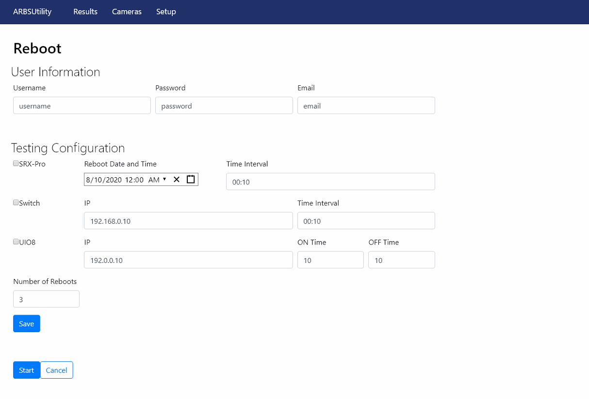
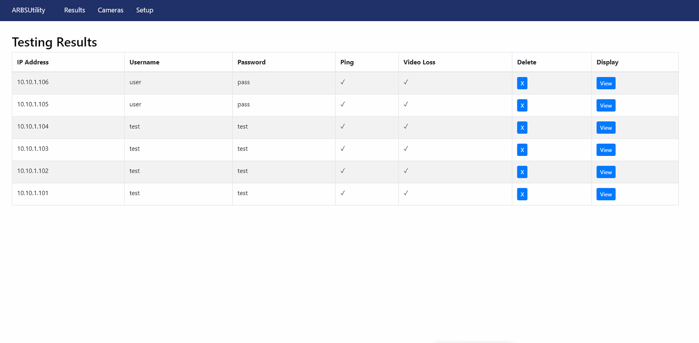

# ARBSUtility
In progress: ARBSUtility (Automated Reboot System Utility) is a cross-platform application used for the automated testing of IP Cameras using the UIO8 I/O Controller. Created with React, Electron, and Go. Uses network programmming to communicate with IP cameras and controlled devices.

## Project Overview
The purpose of this project is to create an application to automate the testing process for the stress testing of cameras and NVR systems. Rather than having to reboot and test the cameras manually, the tester can input testing parameters and the application will reboot the appropriate systems as required. Following the testing, the results will be shown to the tester. If an error occurs (either failed ping test or video loss), the testing will stop immediately, and the tester will be notified. This project encompasses three parts: desktop GUI, web server service, and mobile application.

## Needs Assessment
As manual testing of hardware and software is quite cumbersome and time-consuming for users, this application will automatically perform these tasks and call the user only when necessary. This allows engineers to make better use of their time and make new developments, rather than spending their time on performance testing. This will, in turn, make the development process much faster and more efficient, allowing businesses to effectively improve their products. Moreover, this repeated stress testing can mimic real-life scenarios (ie. Power outages, updates, bugs) more effectively and quickly, allowing engineers to identify and solve these problems much faster.

## Features 
-	Automatic time-based rebooting of: 1 – SRX-Pro, 2 – Switches, 3 – UIO8 Microcontroller
-	User-friendly UI that can be easily used by the tester.
-	Immediate testing results for each camera (ping, video loss).
-	E-mail notifications for users when a problem occurs during testing.
-	Simulates the error state by force stopping the test when a problem with the cameras is found.
-	Application running as: 1 – Desktop application, 2 – Service with web server, 3 – Mobile app

## Development 
To start server, 
`
cd client/ui`, and `npm run server`
To build, 
`
cd client/UI`, and `npm start`

To run,
`cd client/ui`, and `npm run go`

To run server, client, and Go code together, run 
`cd client/ui` and `npm run dev`

To run backend functions, run
`cd client/ui/src` `go build` and `./src`

To create executable, run 
`npm run pkg`or use the arbs exe

Front-end developed with React JS, implementing Redux for setup and camera state management. Application run in a Go program using Gotron, a Go API for Electron to create cross-platform applications. Backend server created in JSON format. Main backend features written in Go, including rebooting and result retrieval through TCP/IP (HTTP, RTSP) connection to network devices.

